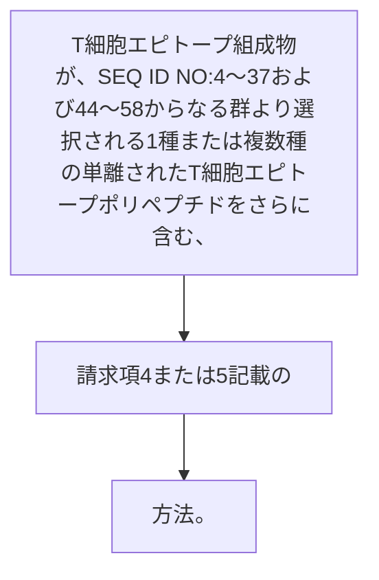

T細胞エピトープ組成物が、SEQ ID NO:4～37および44～58からなる群より選択される1種または複数種の単離されたT細胞エピトープポリペプチドをさらに含む、請求項4または5記載の方法。

```mermaid
flowchart TD
A[T細胞エピトープ組成物が、SEQ ID NO:4～37および44～58からなる群より選択される1種または複数種の単離されたT細胞エピトープポリペプチドをさらに含む、]
B[請求項4または5記載の]
C[方法。]
A --> B
B --> C
```