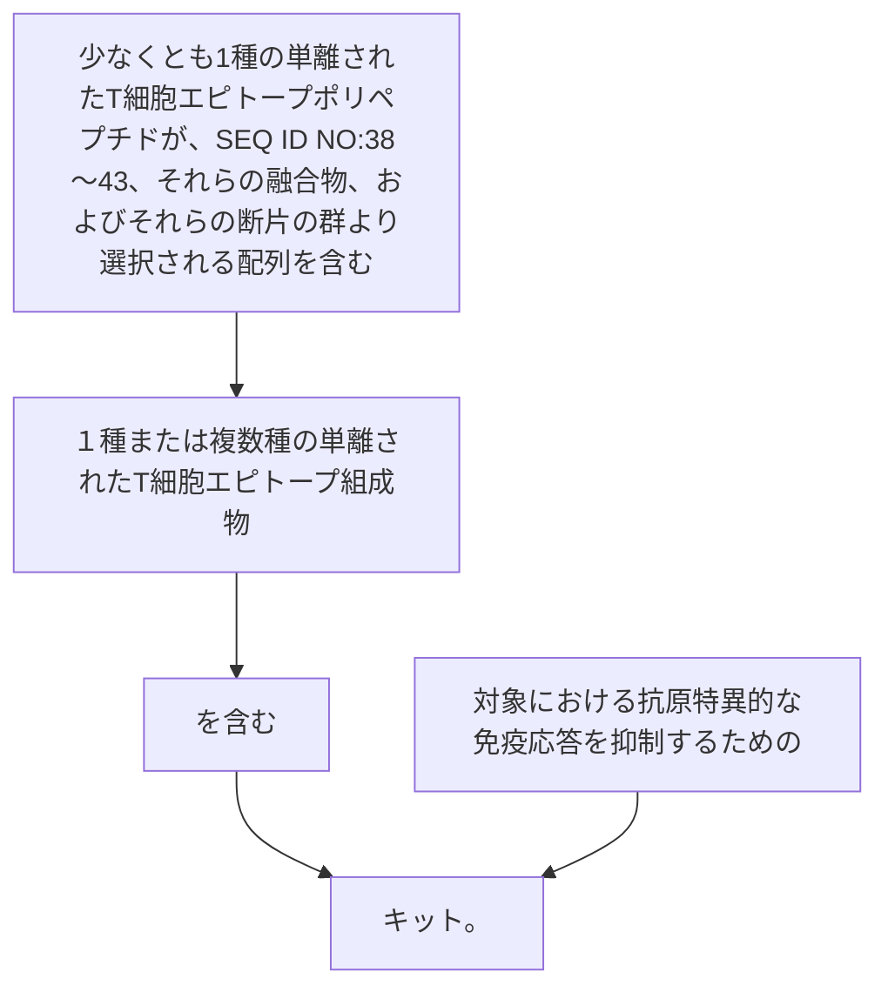

少なくとも1種の単離されたT細胞エピトープポリペプチドが、SEQ ID NO:38～43、それらの融合物、およびそれらの断片の群より選択される配列を含む、１種または複数種の単離されたT細胞エピトープ組成物を含む、対象における抗原特異的な免疫応答を抑制するためのキット。

```mermaid
flowchart TD
A[少なくとも1種の単離されたT細胞エピトープポリペプチドが、SEQ ID NO:38～43、それらの融合物、およびそれらの断片の群より選択される配列を含む]
B[１種または複数種の単離されたT細胞エピトープ組成物]
C[を含む]
D[対象における抗原特異的な免疫応答を抑制するための]
E[キット。]
A --> B
B --> C
C --> E
D --> E
```