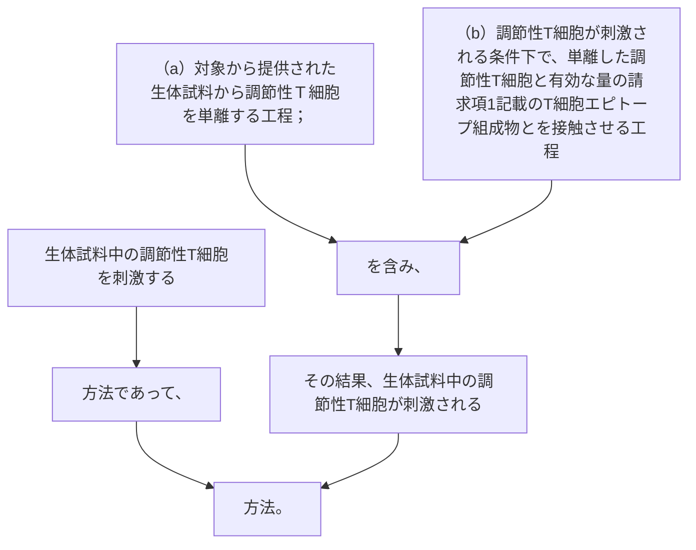

生体試料中の調節性T細胞を刺激する方法であって、
（a）対象から提供された生体試料から調節性Ｔ細胞を単離する工程；
（b）調節性T細胞が刺激される条件下で、単離した調節性T細胞と有効な量の請求項1記載のT細胞エピトープ組成物とを接触させる工程
を含み、その結果、生体試料中の調節性T細胞が刺激される方法。

```mermaid
flowchart TD
A[生体試料中の調節性T細胞を刺激する]
B[方法であって、]
C[（a）対象から提供された生体試料から調節性Ｔ細胞を単離する工程；]
D[（b）調節性T細胞が刺激される条件下で、単離した調節性T細胞と有効な量の請求項1記載のT細胞エピトープ組成物とを接触させる工程]
E[を含み、]
F[その結果、生体試料中の調節性T細胞が刺激される]
G[方法。]
A --> B
B --> G
C --> E
D --> E
E --> F
F --> G
```