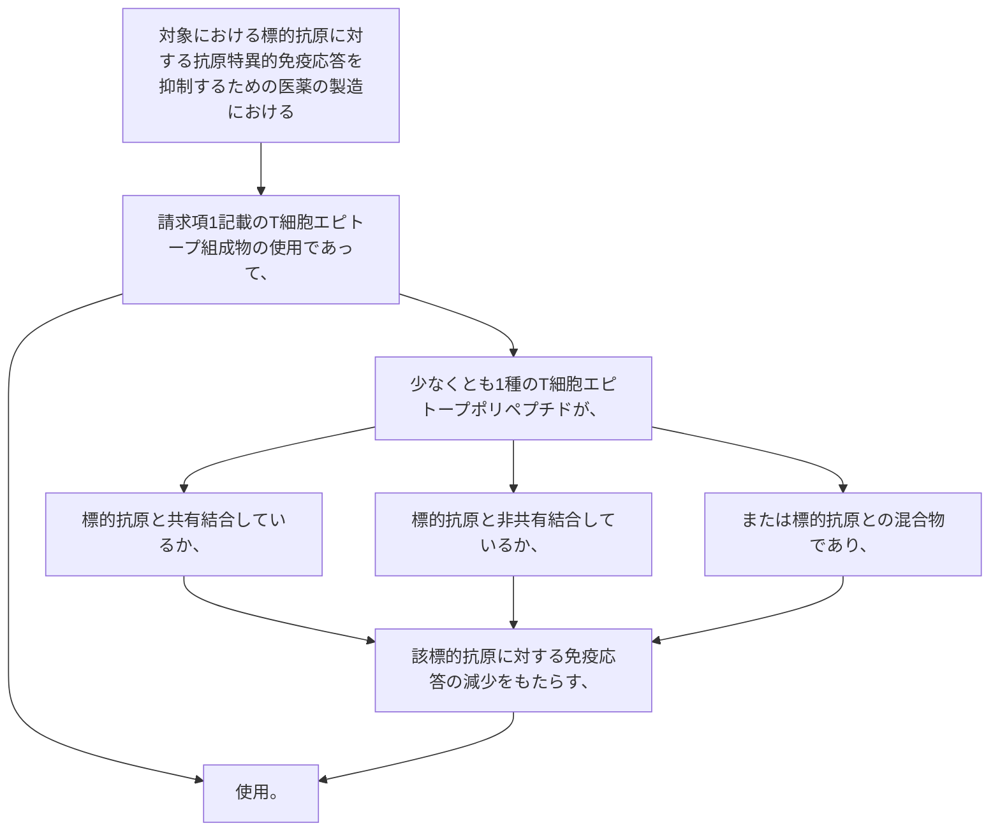

対象における標的抗原に対する抗原特異的免疫応答を抑制するための医薬の製造における、請求項1記載のT細胞エピトープ組成物の使用であって、少なくとも1種のT細胞エピトープポリペプチドが、標的抗原と共有結合しているか、標的抗原と非共有結合しているか、または標的抗原との混合物であり、該標的抗原に対する免疫応答の減少をもたらす、使用。

```mermaid
flowchart TD
A[対象における標的抗原に対する抗原特異的免疫応答を抑制するための医薬の製造における]
B[請求項1記載のT細胞エピトープ組成物の使用であって、]
C[少なくとも1種のT細胞エピトープポリペプチドが、]
D[標的抗原と共有結合しているか、]
E[標的抗原と非共有結合しているか、]
F[または標的抗原との混合物であり、]
G[該標的抗原に対する免疫応答の減少をもたらす、]
H[使用。]
A --> B
B --> C
B --> H
C --> D
C --> E
C --> F
D --> G
E --> G
F --> G
G --> H
```