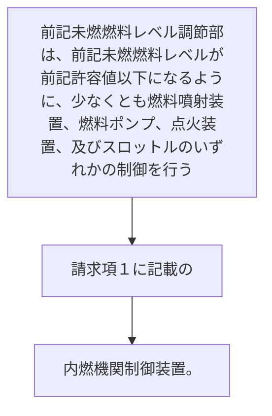

前記未燃燃料レベル調節部は、前記未燃燃料レベルが前記許容値以下になるように、少なくとも燃料噴射装置、燃料ポンプ、点火装置、及びスロットルのいずれかの制御を行う
請求項１に記載の内燃機関制御装置。

```mermaid
flowchart TD
A[前記未燃燃料レベル調節部は、前記未燃燃料レベルが前記許容値以下になるように、少なくとも燃料噴射装置、燃料ポンプ、点火装置、及びスロットルのいずれかの制御を行う]
B[請求項１に記載の]
C[内燃機関制御装置。]
A --> B
B --> C
```