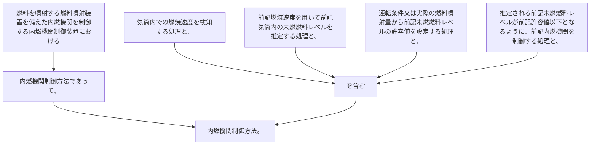

```mermaid
flowchart TD
A[燃料を噴射する燃料噴射装置を備えた内燃機関を制御する内燃機関制御装置における]
B[内燃機関制御方法であって、]
C[気筒内での燃焼速度を検知する処理と、]
D[前記燃焼速度を用いて前記気筒内の未燃燃料レベルを推定する処理と、]
E[運転条件又は実際の燃料噴射量から前記未燃燃料レベルの許容値を設定する処理と、]
F[推定される前記未燃燃料レベルが前記許容値以下となるように、前記内燃機関を制御する処理と、]
G[を含む]
H[内燃機関制御方法。]
A --> B
B --> H
C --> G
D --> G
E --> G
F --> G
G --> H
```