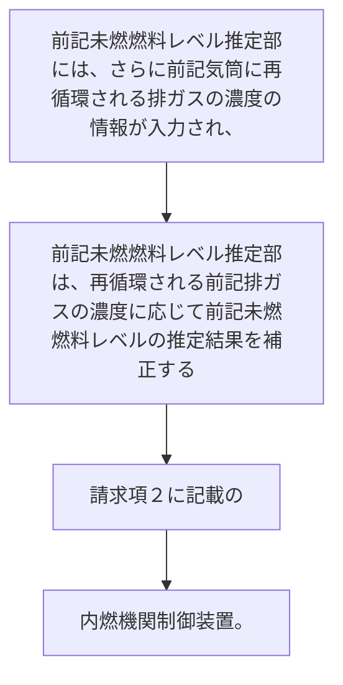

前記未燃燃料レベル推定部には、さらに前記気筒に再循環される排ガスの濃度の情報が入力され、前記未燃燃料レベル推定部は、再循環される前記排ガスの濃度に応じて前記未燃燃料レベルの推定結果を補正する
請求項２に記載の内燃機関制御装置。

```mermaid
flowchart TD
A[前記未燃燃料レベル推定部には、さらに前記気筒に再循環される排ガスの濃度の情報が入力され、]
B[前記未燃燃料レベル推定部は、再循環される前記排ガスの濃度に応じて前記未燃燃料レベルの推定結果を補正する]
C[請求項２に記載の]
D[内燃機関制御装置。]
A --> B
B --> C
C --> D
```