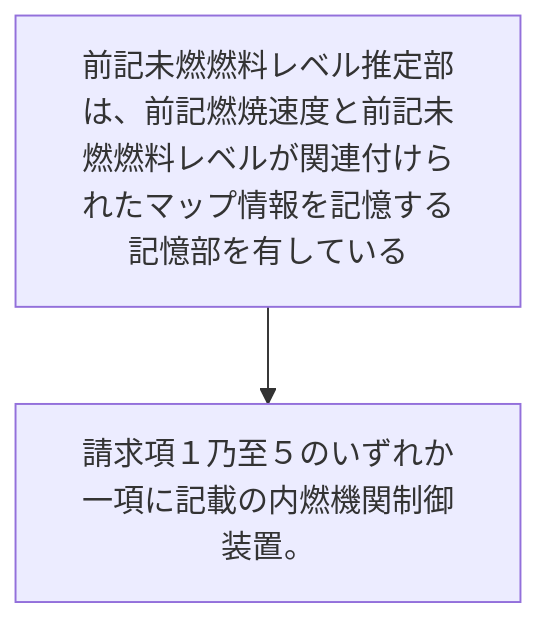

前記未燃燃料レベル推定部は、前記燃焼速度と前記未燃燃料レベルが関連付けられたマップ情報を記憶する記憶部を有している
請求項１乃至５のいずれか一項に記載の内燃機関制御装置。

```mermaid
flowchart TD
A[前記未燃燃料レベル推定部は、前記燃焼速度と前記未燃燃料レベルが関連付けられたマップ情報を記憶する記憶部を有している]
B[請求項１乃至５のいずれか一項に記載の内燃機関制御装置。]
A --> B
```