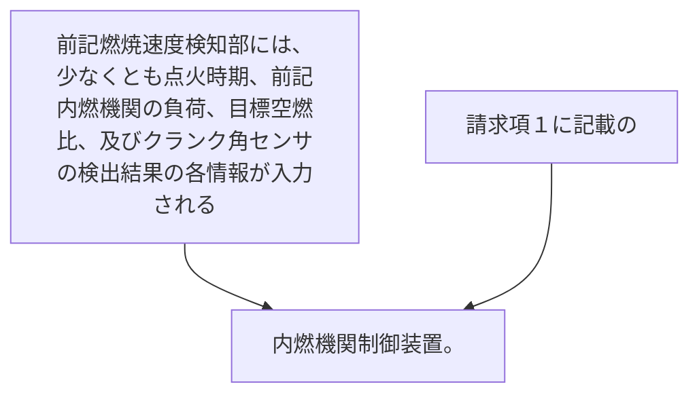

前記燃焼速度検知部には、少なくとも点火時期、前記内燃機関の負荷、目標空燃比、及びクランク角センサの検出結果の各情報が入力される
請求項１に記載の内燃機関制御装置。

```mermaid
flowchart TD
A[前記燃焼速度検知部には、少なくとも点火時期、前記内燃機関の負荷、目標空燃比、及びクランク角センサの検出結果の各情報が入力される]
B[請求項１に記載の]
C[内燃機関制御装置。]
A --> C
B --> C
```