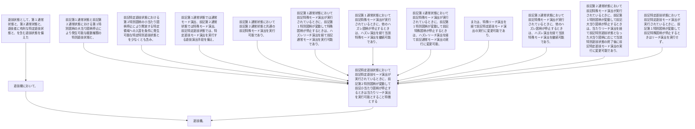

```mermaid
flowchart TD
A[遊技状態として、第１通常状態と、第２通常状態と、遊技者に有利な特定遊技状態と、を含む遊技状態を備えた]
B[遊技機において、]
C[前記第１通常状態と前記第２通常状態における第１特別図柄の大当り図柄停止により発生可能な複数種類の特別遊技状態と、]
D[前記特定遊技状態における第２特別図柄の小当たり図柄停止により開放する特定領域への入賞を条件に発生可能な特定特別遊技状態とを少なくとも含み、]
E[前記第１通常状態では通常モード演出、前記第２通常状態では特殊モード演出、前記特定遊技状態では、特定遊技モード演出を実行する遊技演出手段を備え、]
F[前記第１通常状態において前記第２通常状態と共通の前記特殊モード演出を実行可能であり、]
G[前記第１通常状態において前記特殊モード演出が実行されているときに、前記第１特別図柄が変動して特殊図柄が停止するときは、ハズレリーチ演出を経て前記通常モード演出を実行可能であり、]
H[前記第１通常状態において前記特殊モード演出が実行されているときに、他のハズレ図柄が停止するときは、ハズレ演出を経て当該特殊モード演出を継続可能であり、]
I[前記第２通常状態において前記特殊モード演出が実行されているときに、前記第１特別図柄が変動して前記特殊図柄が停止するときは、ハズレリーチ演出を経て前記通常モード演出の実行に変更可能、]
J[または、特殊リーチ演出を経て前記特定遊技モード演出の実行に変更可能であり、]
K[前記第２通常状態において前記特殊モード演出が実行されているときに、他のハズレ図柄が停止するときは、ハズレ演出を経て当該特殊モード演出を継続可能であり、]
L[前記第２通常状態において前記特殊モード演出が実行されているときに、前記第１特別図柄が変動して前記大当り図柄が停止するときは、当たりリーチ演出を経て前記特別遊技状態となった大当り図柄に応じて当該特別遊技状態の終了後に前記特定遊技モード演出の実行に変更可能であり、]
M[前記特定遊技状態において前記特定遊技モード演出が実行されているときに、前記第１特別図柄が変動して前記特殊図柄が停止するときはリーチ演出を実行せず、]
N[前記特定遊技状態において前記特定遊技モード演出が実行されているときに、前記第２特別図柄が変動して前記小当たり図柄が停止するときは当たりリーチ演出を実行可能とすること特徴とする]
O[遊技機。]

A --> B
B --> O
C --> N
D --> N
E --> N
F --> N
G --> N
H --> N
I --> N
J --> N
K --> N
L --> N
M --> N
N --> O
```