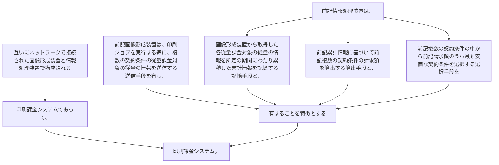

```mermaid
flowchart TD
A[互いにネットワークで接続された画像形成装置と情報処理装置で構成される]
B[印刷課金システムであって、]
C[前記画像形成装置は、印刷ジョブを実行する毎に、複数の契約条件の従量課金対象の従量の情報を送信する送信手段を有し、]
D[前記情報処理装置は、]
E[画像形成装置から取得した各従量課金対象の従量の情報を所定の期間にわたり累積した累計情報を記憶する記憶手段と、]
F[前記累計情報に基づいて前記複数の契約条件の請求額を算出する算出手段と、]
G[前記複数の契約条件の中から前記請求額のうち最も安価な契約条件を選択する選択手段を]
H[有することを特徴とする]
I[印刷課金システム。]
A --> B
B --> I
C --> H
D --> E
D --> F
D --> G
E --> H
F --> H
G --> H
H --> I
```