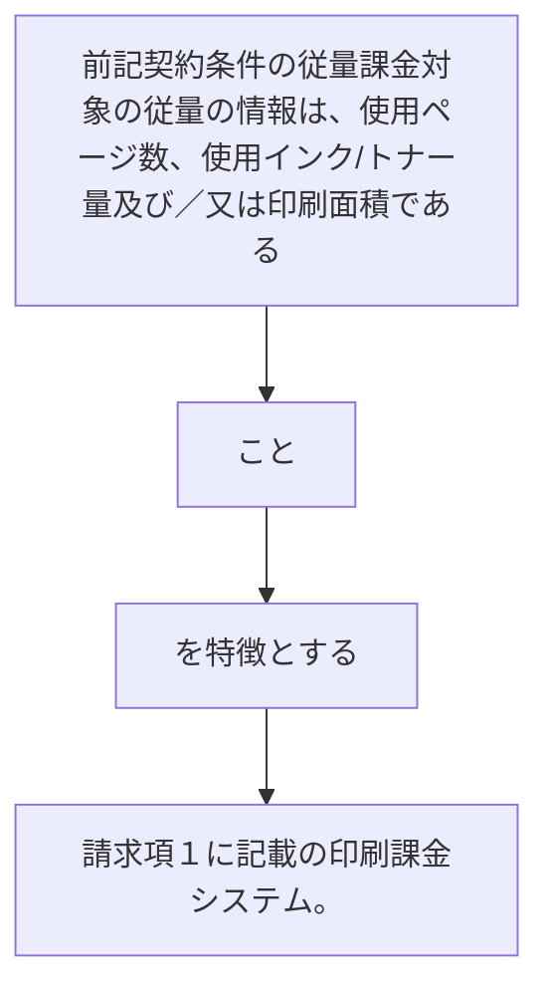

前記契約条件の従量課金対象の従量の情報は、使用ページ数、使用インク/トナー量及び／又は印刷面積であること
を特徴とする請求項１に記載の印刷課金システム。

```mermaid
flowchart TD
A[前記契約条件の従量課金対象の従量の情報は、使用ページ数、使用インク/トナー量及び／又は印刷面積である]
B[こと]
C[を特徴とする]
D[請求項１に記載の印刷課金システム。]
A --> B
B --> C
C --> D
```