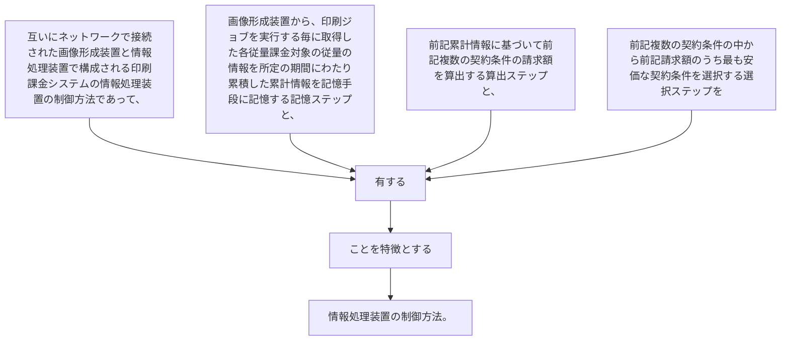

互いにネットワークで接続された画像形成装置と情報処理装置で構成される印刷課金システムの情報処理装置の制御方法であって、
画像形成装置から、印刷ジョブを実行する毎に取得した各従量課金対象の従量の情報を所定の期間にわたり累積した累計情報を記憶手段に記憶する記憶ステップと、
前記累計情報に基づいて前記複数の契約条件の請求額を算出する算出ステップと、
前記複数の契約条件の中から前記請求額のうち最も安価な契約条件を選択する選択ステップを
有することを特徴とする情報処理装置の制御方法。
