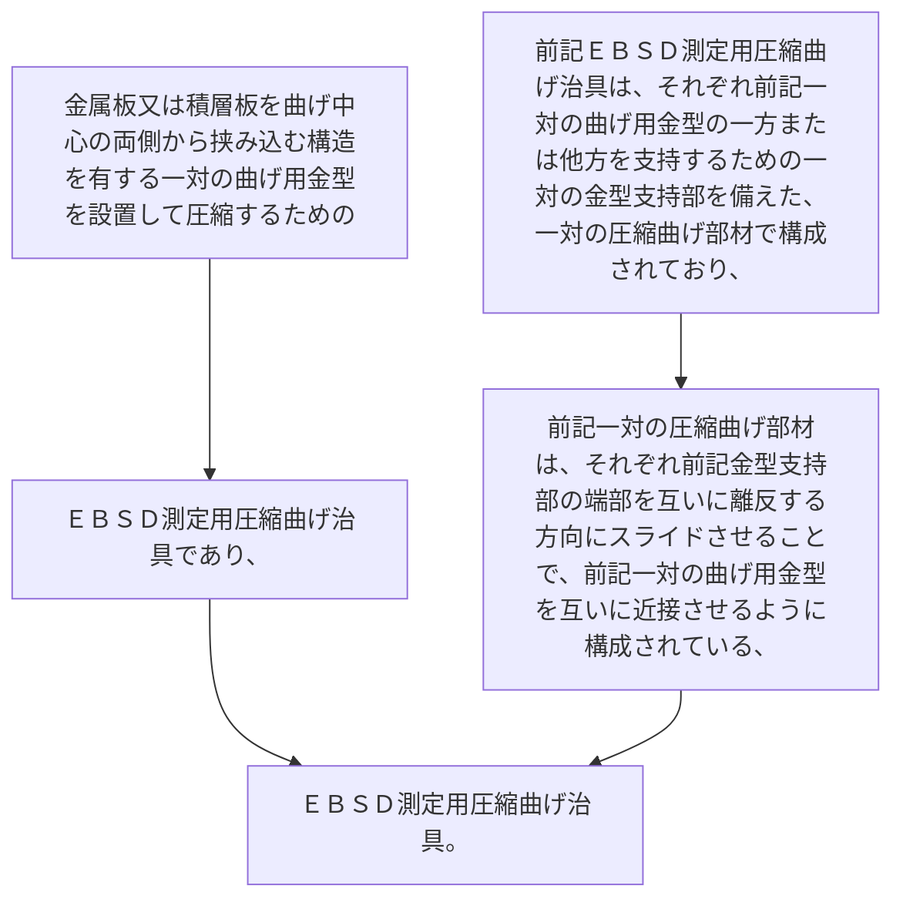

金属板又は積層板を曲げ中心の両側から挟み込む構造を有する一対の曲げ用金型を設置して圧縮するためのＥＢＳＤ測定用圧縮曲げ治具であり、
前記ＥＢＳＤ測定用圧縮曲げ治具は、それぞれ前記一対の曲げ用金型の一方または他方を支持するための一対の金型支持部を備えた、一対の圧縮曲げ部材で構成されており、
前記一対の圧縮曲げ部材は、それぞれ前記金型支持部の端部を互いに離反する方向にスライドさせることで、前記一対の曲げ用金型を互いに近接させるように構成されている、ＥＢＳＤ測定用圧縮曲げ治具。
