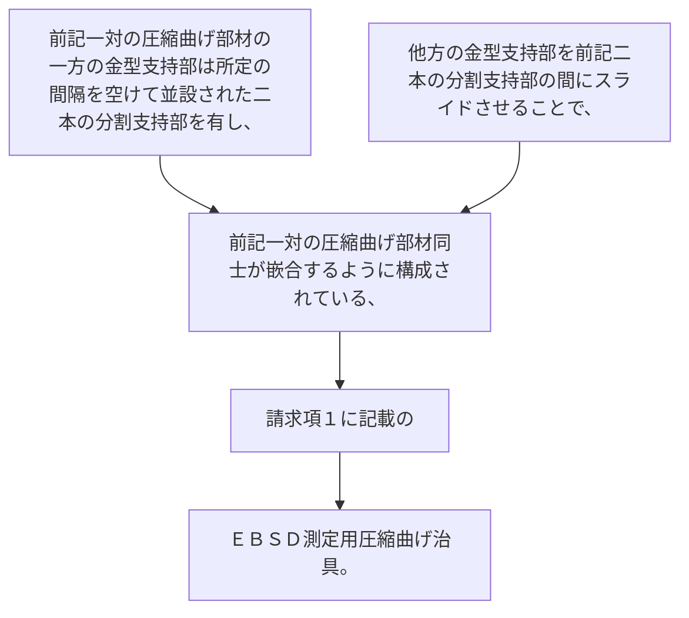

前記一対の圧縮曲げ部材の一方の金型支持部は所定の間隔を空けて並設された二本の分割支持部を有し、他方の金型支持部を前記二本の分割支持部の間にスライドさせることで、前記一対の圧縮曲げ部材同士が嵌合するように構成されている、請求項１に記載のＥＢＳＤ測定用圧縮曲げ治具。

```mermaid
flowchart TD
A[前記一対の圧縮曲げ部材の一方の金型支持部は所定の間隔を空けて並設された二本の分割支持部を有し、]
B[他方の金型支持部を前記二本の分割支持部の間にスライドさせることで、]
C[前記一対の圧縮曲げ部材同士が嵌合するように構成されている、]
D[請求項１に記載の]
E[ＥＢＳＤ測定用圧縮曲げ治具。]

A --> C
B --> C
C --> D
D --> E
```