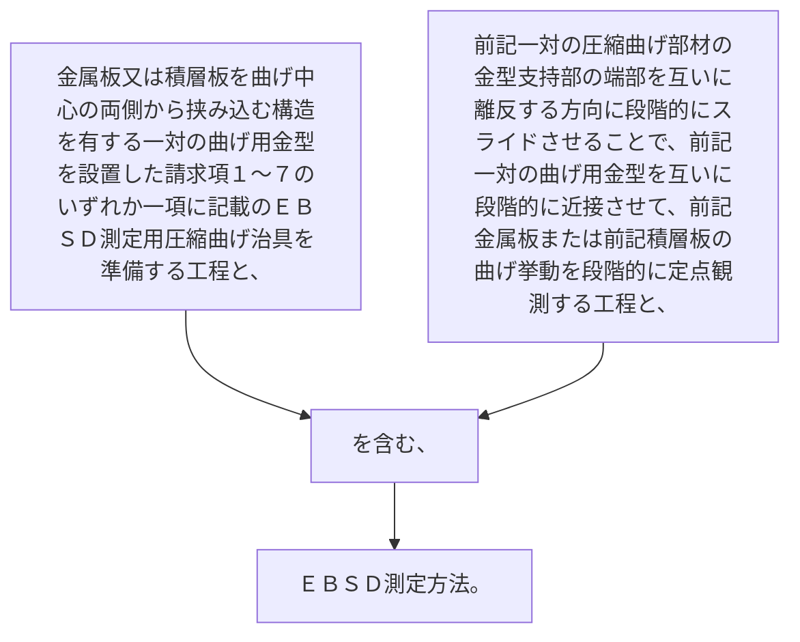

金属板又は積層板を曲げ中心の両側から挟み込む構造を有する一対の曲げ用金型を設置した請求項１～７のいずれか一項に記載のＥＢＳＤ測定用圧縮曲げ治具を準備する工程と、
前記一対の圧縮曲げ部材の金型支持部の端部を互いに離反する方向に段階的にスライドさせることで、前記一対の曲げ用金型を互いに段階的に近接させて、前記金属板または前記積層板の曲げ挙動を段階的に定点観測する工程と、
を含む、ＥＢＳＤ測定方法。
