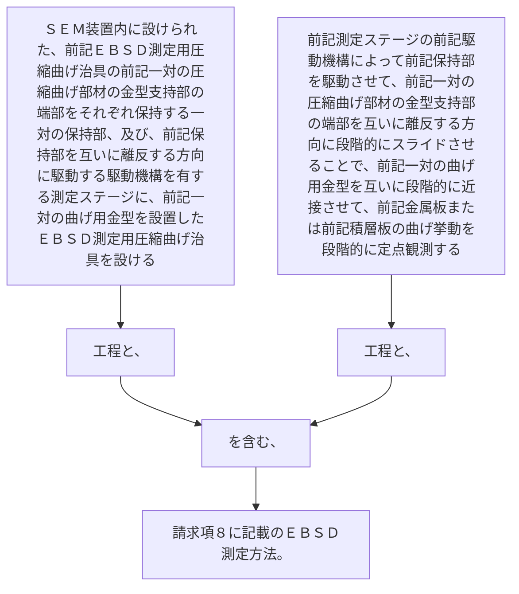

```mermaid
flowchart TD
A[ＳＥＭ装置内に設けられた、前記ＥＢＳＤ測定用圧縮曲げ治具の前記一対の圧縮曲げ部材の金型支持部の端部をそれぞれ保持する一対の保持部、及び、前記保持部を互いに離反する方向に駆動する駆動機構を有する測定ステージに、前記一対の曲げ用金型を設置したＥＢＳＤ測定用圧縮曲げ治具を設ける]
B[工程と、]
C[前記測定ステージの前記駆動機構によって前記保持部を駆動させて、前記一対の圧縮曲げ部材の金型支持部の端部を互いに離反する方向に段階的にスライドさせることで、前記一対の曲げ用金型を互いに段階的に近接させて、前記金属板または前記積層板の曲げ挙動を段階的に定点観測する]
D[工程と、]
E[を含む、]
F[請求項８に記載のＥＢＳＤ測定方法。]

A --> B
C --> D
B --> E
D --> E
E --> F
```