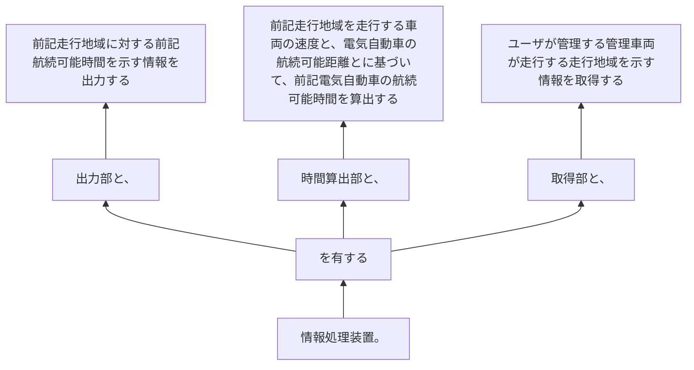

```mermaid
flowchart BT
H[情報処理装置。]
G[を有する]
F[出力部と、]
E[前記走行地域に対する前記航続可能時間を示す情報を出力する]
D[時間算出部と、]
C[前記走行地域を走行する車両の速度と、電気自動車の航続可能距離とに基づいて、前記電気自動車の航続可能時間を算出する]
B[取得部と、]
A[ユーザが管理する管理車両が走行する走行地域を示す情報を取得する]

H --> G
G --> F
G --> D
G --> B
F --> E
D --> C
B --> A
```