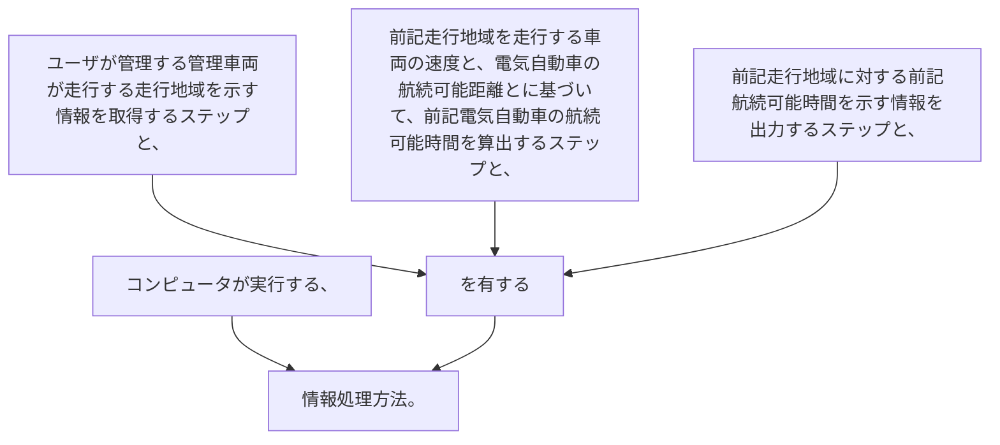

コンピュータが実行する、
ユーザが管理する管理車両が走行する走行地域を示す情報を取得するステップと、
前記走行地域を走行する車両の速度と、電気自動車の航続可能距離とに基づいて、前記電気自動車の航続可能時間を算出するステップと、
前記走行地域に対する前記航続可能時間を示す情報を出力するステップと、
を有する情報処理方法。

```mermaid
flowchart TD
A[コンピュータが実行する、]
B[ユーザが管理する管理車両が走行する走行地域を示す情報を取得するステップと、]
C[前記走行地域を走行する車両の速度と、電気自動車の航続可能距離とに基づいて、前記電気自動車の航続可能時間を算出するステップと、]
D[前記走行地域に対する前記航続可能時間を示す情報を出力するステップと、]
E[を有する]
F[情報処理方法。]
A --> F
B --> E
C --> E
D --> E
E --> F
```