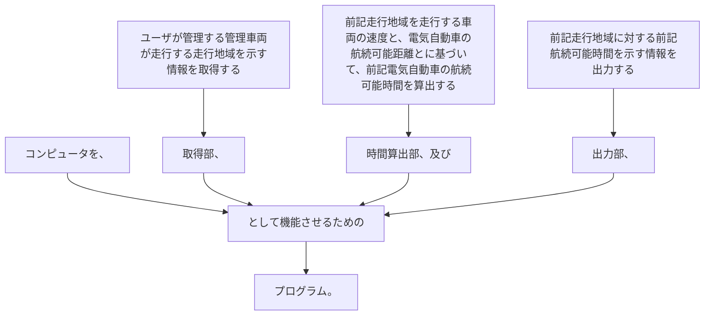

```mermaid
flowchart TD
A[コンピュータを、]
B[ユーザが管理する管理車両が走行する走行地域を示す情報を取得する]
C[取得部、]
D[前記走行地域を走行する車両の速度と、電気自動車の航続可能距離とに基づいて、前記電気自動車の航続可能時間を算出する]
E[時間算出部、及び]
F[前記走行地域に対する前記航続可能時間を示す情報を出力する]
G[出力部、]
H[として機能させるための]
I[プログラム。]
A --> H
B --> C
C --> H
D --> E
E --> H
F --> G
G --> H
H --> I
```