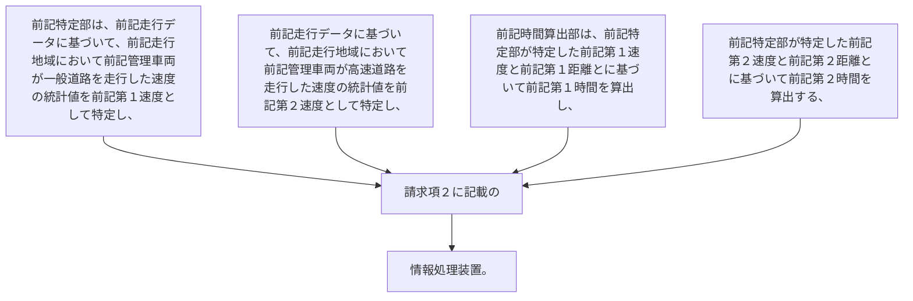

```mermaid
flowchart TD
A[前記特定部は、前記走行データに基づいて、前記走行地域において前記管理車両が一般道路を走行した速度の統計値を前記第１速度として特定し、]
B[前記走行データに基づいて、前記走行地域において前記管理車両が高速道路を走行した速度の統計値を前記第２速度として特定し、]
C[前記時間算出部は、前記特定部が特定した前記第１速度と前記第１距離とに基づいて前記第１時間を算出し、]
D[前記特定部が特定した前記第２速度と前記第２距離とに基づいて前記第２時間を算出する、]
E[請求項２に記載の]
F[情報処理装置。]
A --> E
B --> E
C --> E
D --> E
E --> F
```