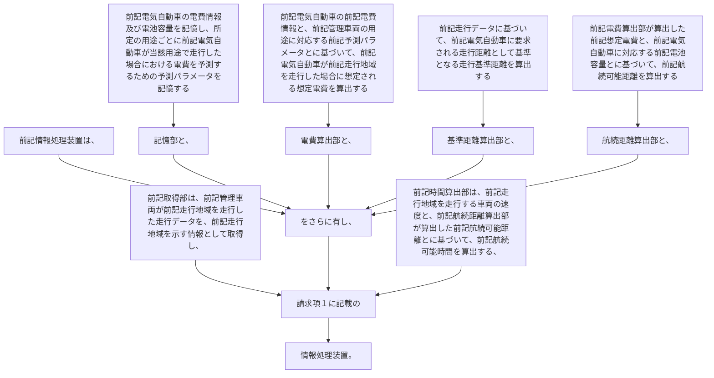

```mermaid
flowchart TD
A[前記取得部は、前記管理車両が前記走行地域を走行した走行データを、前記走行地域を示す情報として取得し、]
B[前記情報処理装置は、]
C[前記電気自動車の電費情報及び電池容量を記憶し、所定の用途ごとに前記電気自動車が当該用途で走行した場合における電費を予測するための予測パラメータを記憶する]
D[記憶部と、]
E[前記電気自動車の前記電費情報と、前記管理車両の用途に対応する前記予測パラメータとに基づいて、前記電気自動車が前記走行地域を走行した場合に想定される想定電費を算出する]
F[電費算出部と、]
G[前記走行データに基づいて、前記電気自動車に要求される走行距離として基準となる走行基準距離を算出する]
H[基準距離算出部と、]
I[前記電費算出部が算出した前記想定電費と、前記電気自動車に対応する前記電池容量とに基づいて、前記航続可能距離を算出する]
J[航続距離算出部と、]
K[をさらに有し、]
L[前記時間算出部は、前記走行地域を走行する車両の速度と、前記航続距離算出部が算出した前記航続可能距離とに基づいて、前記航続可能時間を算出する、]
M[請求項１に記載の]
N[情報処理装置。]

A --> M
B --> K
C --> D
E --> F
G --> H
I --> J
D --> K
F --> K
H --> K
J --> K
K --> M
L --> M
M --> N
```