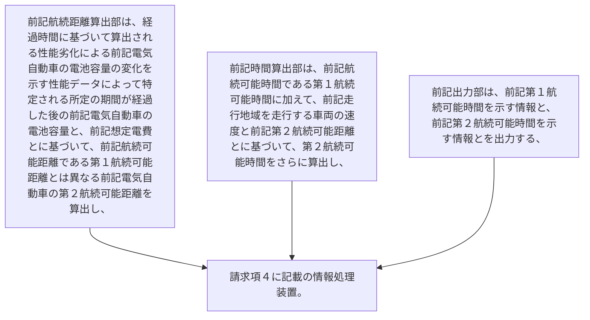

```mermaid
flowchart TD
A[前記航続距離算出部は、経過時間に基づいて算出される性能劣化による前記電気自動車の電池容量の変化を示す性能データによって特定される所定の期間が経過した後の前記電気自動車の電池容量と、前記想定電費とに基づいて、前記航続可能距離である第１航続可能距離とは異なる前記電気自動車の第２航続可能距離を算出し、]
B[前記時間算出部は、前記航続可能時間である第１航続可能時間に加えて、前記走行地域を走行する車両の速度と前記第２航続可能距離とに基づいて、第２航続可能時間をさらに算出し、]
C[前記出力部は、前記第１航続可能時間を示す情報と、前記第２航続可能時間を示す情報とを出力する、]
D[請求項４に記載の情報処理装置。]
A --> D
B --> D
C --> D
```