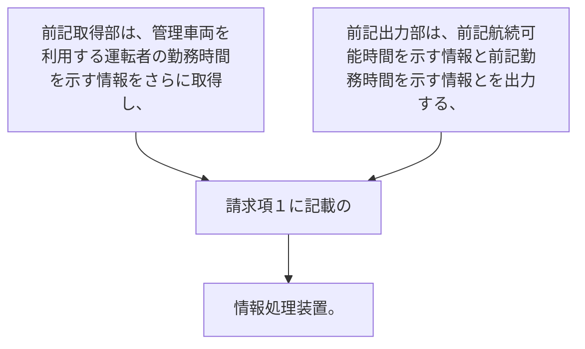

前記取得部は、管理車両を利用する運転者の勤務時間を示す情報をさらに取得し、
前記出力部は、前記航続可能時間を示す情報と前記勤務時間を示す情報とを出力する、
請求項１に記載の情報処理装置。

```mermaid
flowchart TD
A[前記取得部は、管理車両を利用する運転者の勤務時間を示す情報をさらに取得し、]
B[前記出力部は、前記航続可能時間を示す情報と前記勤務時間を示す情報とを出力する、]
C[請求項１に記載の]
D[情報処理装置。]
A --> C
B --> C
C --> D
```