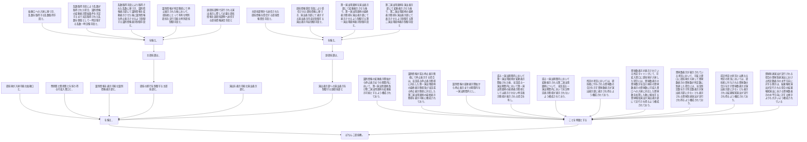

```mermaid
flowchart TD
    N1[遊技球が入球可能な始動口と、]
    N2[閉状態と開状態とを採り得る可変入賞口と、]
    N3[識別情報を表示可能な識別情報表示部と、]
    N4[遊技の進行を制御する主遊技部と、]
    N5[演出を表示可能な演出表示部と、]
    N6[演出表示部への演出表示を制御する副遊技部と]
    N7[を備え、]

    N9[主遊技部は、]
    N10[始動口への入球に基づき、乱数を取得する乱数取得手段と、]
    N11[乱数取得手段により乱数が取得された場合、識別情報の変動表示開始条件を充足するまで当該取得された乱数を保留として一時記憶する乱数一時記憶手段と、]
    N12[乱数取得手段により取得された乱数に基づき、識別情報表示部にて識別情報を変動表示させた後に識別情報を停止表示させるよう制御する識別情報表示制御手段と、]
    N13[識別情報が所定態様にて停止表示された後において、遊技者にとって有利な特別遊技を実行可能な特別遊技制御手段と、]
    N14[副遊技部側で実行される演出表示に際して必要な遊技情報を副遊技部側へ送信する遊技情報送信手段と]
    N15[を備え、]

    N16[副遊技部は、]
    N17[主遊技部側から送信された遊技情報を受信する遊技情報受信手段と、]
    N18[遊技情報受信手段により受信された遊技情報に基づき、演出表示部にて表示する演出表示内容を制御する演出表示内容制御手段と、]
    N19[第一演出用図柄を演出表示部にて変動表示させた後で、第一演出用図柄の最終表示態様を演出表示部にて表示させるよう制御する第一演出用図柄表示制御手段と、]
    N20[第二演出用図柄を演出表示部にて変動表示させた後で、第二演出用図柄の最終表示態様を演出表示部にて表示させるよう制御する第二演出用図柄表示制御手段と]
    N21[を備え、]

    N22[識別情報の変動表示開始から停止表示までの期間内において、第一演出用図柄及び第二演出用図柄を変動表示可能とするよう構成されており、]
    N23[識別情報が或る停止表示態様にて停止表示する場合は、当該或る停止表示態様に対応した第一演出用図柄の最終表示態様及び当該或る停止表示態様に対応した第二演出用図柄の最終表示態様を表示可能に構成されており、]
    N24[識別情報の変動表示開始から停止表示までの期間内を一演出期間内とし、]
    N25[或る一演出期間内において第一演出用図柄が変動表示開始された後、当該或る一演出期間内において第一演出用図柄の最終表示態様としては表示されない特定表示態様が表示される場合を有し、]
    N26[或る一演出期間内において変動表示される第二演出用図柄について、当該或る一演出期間内において前記特定表示態様が表示されないよう構成されており、]
    N27[所定の状況においては、遊技者に付与される賞球数の合計を示す賞球数表示が演出表示部に表示され得るよう構成されており、]
    N28[賞球数表示が表示されている所定タイミングにて、可変入賞口に遊技球が入球した場合には、賞球数表示の賞球数が当該入球前の賞球数表示の賞球数に可変入賞口への入球に対応した賞球数を加算した数に増加する賞球増加演出が演出表示部にて実行され得るよう構成されており、]
    N29[賞球数表示が表示されている状況において、可変入賞口に遊技球が入球して賞球数表示の賞球数が所定数に到達した場合には、当該所定数を示す所定数表示が演出表示部に少なくとも表示される賞球到達演出が実行され得るよう構成されており、]
    N30[前記所定の状況とは異なる特定の状況においては、遊技者に付与される賞球数の合計を示す賞球数表示が演出表示部に少なくとも表示される結果報知演出が実行され得るよう構成されており、]
    N31[賞球到達演出が実行される場合の賞球到達演出における所定数表示の水平方向に対する傾きは、結果報知演出が実行される場合の結果報知演出における賞球数表示の水平方向に対する傾きよりも大きいよう構成されている]

    N32[ことを特徴とする]
    N33[ぱちんこ遊技機。]

    N1 --> N7
    N2 --> N7
    N3 --> N7
    N4 --> N7
    N5 --> N7
    N6 --> N7
    N7 --> N33

    N9 --> N4
    N10 --> N15
    N11 --> N15
    N12 --> N15
    N13 --> N15
    N14 --> N15
    N15 --> N9

    N16 --> N6
    N17 --> N21
    N18 --> N21
    N19 --> N21
    N20 --> N21
    N21 --> N16

    N22 --> N32
    N23 --> N32
    N24 --> N32
    N25 --> N32
    N26 --> N32
    N27 --> N32
    N28 --> N32
    N29 --> N32
    N30 --> N32
    N31 --> N32
    N32 --> N33
```