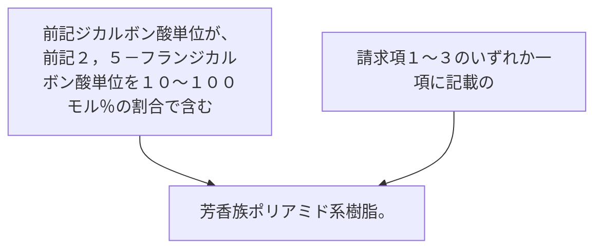

前記ジカルボン酸単位が、前記２，５－フランジカルボン酸単位を１０～１００モル％の割合で含む請求項１～３のいずれか一項に記載の芳香族ポリアミド系樹脂。

```mermaid
flowchart TD
A[前記ジカルボン酸単位が、前記２，５－フランジカルボン酸単位を１０～１００モル％の割合で含む]
B[請求項１～３のいずれか一項に記載の]
C[芳香族ポリアミド系樹脂。]
A --> C
B --> C
```