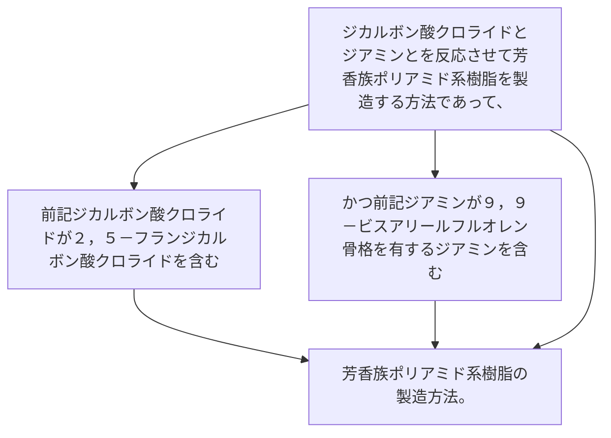

```mermaid
flowchart TD
A[ジカルボン酸クロライドとジアミンとを反応させて芳香族ポリアミド系樹脂を製造する方法であって、]
B[前記ジカルボン酸クロライドが２，５－フランジカルボン酸クロライドを含む]
C[かつ前記ジアミンが９，９－ビスアリールフルオレン骨格を有するジアミンを含む]
D[芳香族ポリアミド系樹脂の製造方法。]
A --> B
A --> C
B --> D
C --> D
A --> D
```