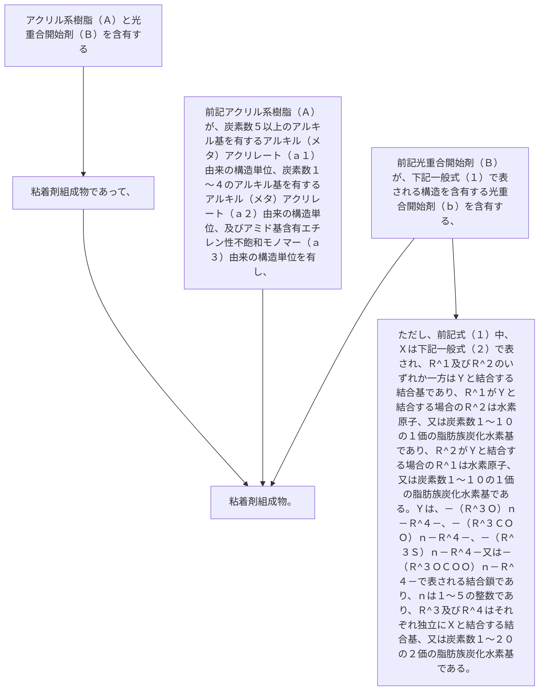

アクリル系樹脂（Ａ）と光重合開始剤（Ｂ）を含有する粘着剤組成物であって、
前記アクリル系樹脂（Ａ）が、炭素数５以上のアルキル基を有するアルキル（メタ）アクリレート（ａ１）由来の構造単位、炭素数１～４のアルキル基を有するアルキル（メタ）アクリレート（ａ２）由来の構造単位、及びアミド基含有エチレン性不飽和モノマー（ａ３）由来の構造単位を有し、
前記光重合開始剤（Ｂ）が、下記一般式（１）で表される構造を含有する光重合開始剤（ｂ）を含有する、粘着剤組成物。
［ただし、前記式（１）中、Ｘは下記一般式（２）で表され、Ｒ
^１
及びＲ
^２
のいずれか一方はＹと結合する結合基であり、Ｒ
^１
がＹと結合する場合のＲ
^２
は水素原子、又は炭素数１～１０の１価の脂肪族炭化水素基であり、Ｒ
^２
がＹと結合する場合のＲ
^１
は水素原子、又は炭素数１～１０の１価の脂肪族炭化水素基である。Ｙは、－（Ｒ
^３
Ｏ）
ｎ
－Ｒ
^４
－、－（Ｒ
^３
ＣＯＯ）
ｎ
－Ｒ
^４
－、－（Ｒ
^３
Ｓ）
ｎ
－Ｒ
^４
－又は－（Ｒ
^３
ＯＣＯＯ）
ｎ
－Ｒ
^４
－で表される結合鎖であり、ｎは１～５の整数であり、Ｒ
^３
及びＲ
^４
はそれぞれ独立にＸと結合する結合基、又は炭素数１～２０の２価の脂肪族炭化水素基である。］
