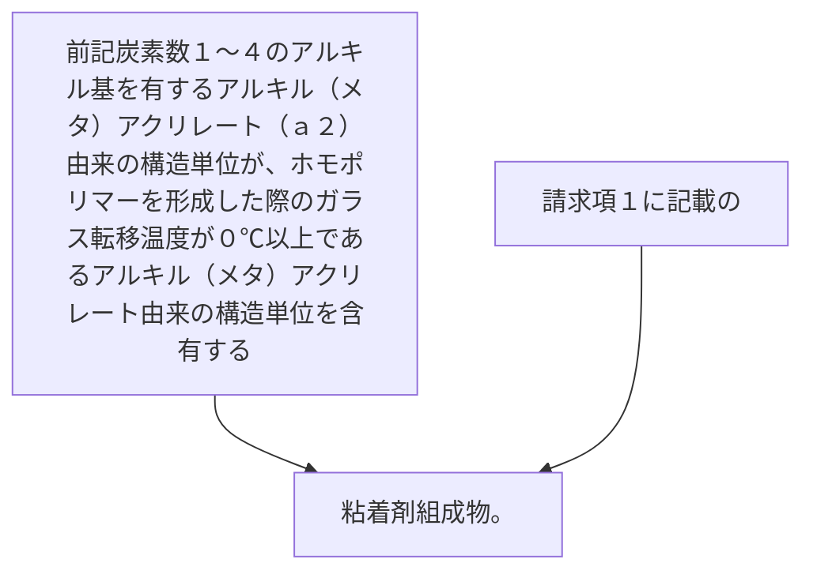

前記炭素数１～４のアルキル基を有するアルキル（メタ）アクリレート（ａ２）由来の構造単位が、ホモポリマーを形成した際のガラス転移温度が０℃以上であるアルキル（メタ）アクリレート由来の構造単位を含有する、請求項１に記載の粘着剤組成物。

```mermaid
flowchart TD
A[前記炭素数１～４のアルキル基を有するアルキル（メタ）アクリレート（ａ２）由来の構造単位が、ホモポリマーを形成した際のガラス転移温度が０℃以上であるアルキル（メタ）アクリレート由来の構造単位を含有する]
B[請求項１に記載の]
C[粘着剤組成物。]
A --> C
B --> C
```