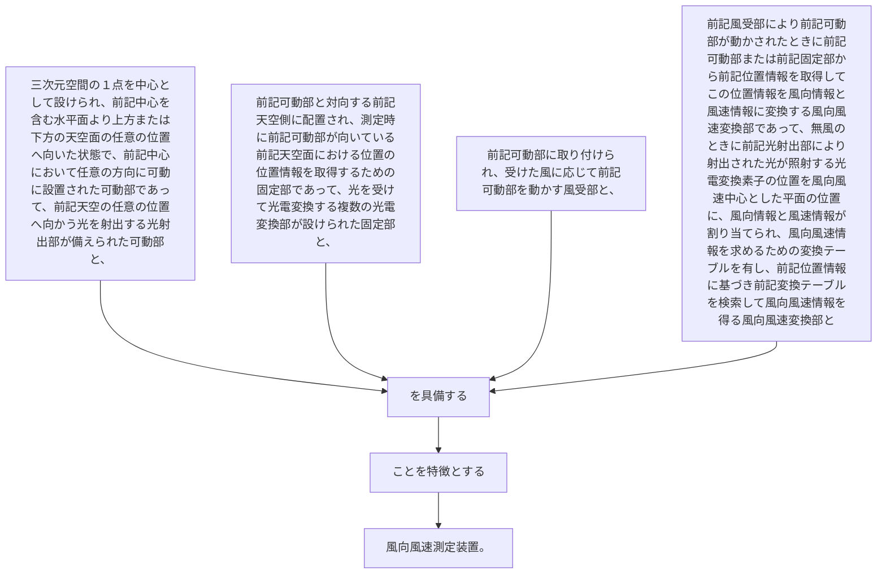

三次元空間の１点を中心として設けられ、前記中心を含む水平面より上方または下方の天空面の任意の位置へ向いた状態で、前記中心において任意の方向に可動に設置された可動部であって、前記天空の任意の位置へ向かう光を射出する光射出部が備えられた可動部と、
前記可動部と対向する前記天空側に配置され、測定時に前記可動部が向いている前記天空面における位置の位置情報を取得するための固定部であって、光を受けて光電変換する複数の光電変換部が設けられた固定部と、
前記可動部に取り付けられ、受けた風に応じて前記可動部を動かす風受部と、
前記風受部により前記可動部が動かされたときに前記可動部または前記固定部から前記位置情報を取得してこの位置情報を風向情報と風速情報に変換する風向風速変換部であって、無風のときに前記光射出部により射出された光が照射する光電変換素子の位置を風向風速中心とした平面の位置に、風向情報と風速情報が割り当てられ、風向風速情報を求めるための変換テーブルを有し、前記位置情報に基づき前記変換テーブルを検索して風向風速情報を得る風向風速変換部と
を具備することを特徴とする風向風速測定装置。
