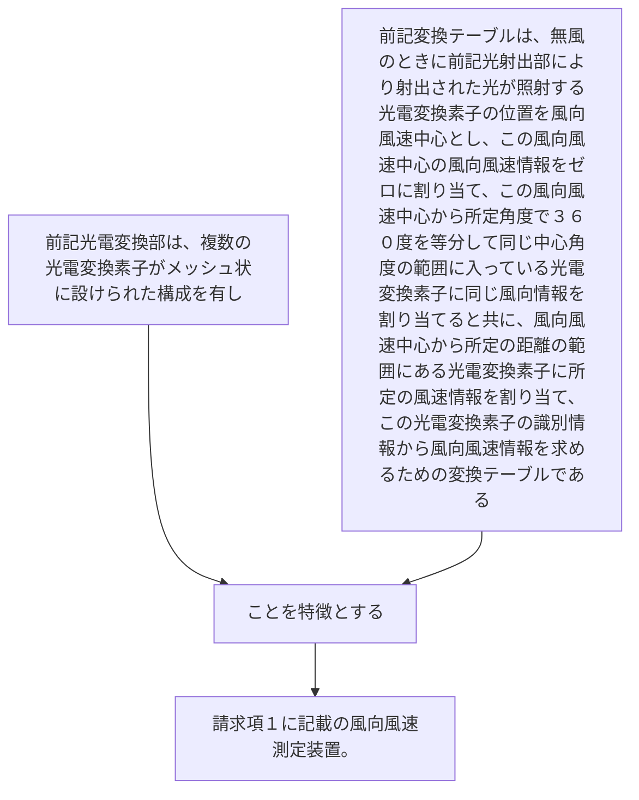

前記光電変換部は、複数の光電変換素子がメッシュ状に設けられた構成を有し
前記変換テーブルは、無風のときに前記光射出部により射出された光が照射する光電変換素子の位置を風向風速中心とし、この風向風速中心の風向風速情報をゼロに割り当て、この風向風速中心から所定角度で３６０度を等分して同じ中心角度の範囲に入っている光電変換素子に同じ風向情報を割り当てると共に、風向風速中心から所定の距離の範囲にある光電変換素子に所定の風速情報を割り当て、この光電変換素子の識別情報から風向風速情報を求めるための変換テーブルであることを特徴とする請求項１に記載の風向風速測定装置。
