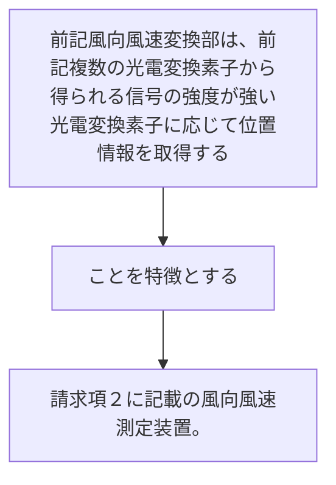

前記風向風速変換部は、前記複数の光電変換素子から得られる信号の強度が強い光電変換素子に応じて位置情報を取得することを特徴とする請求項２に記載の風向風速測定装置。

```mermaid
flowchart TD
A[前記風向風速変換部は、前記複数の光電変換素子から得られる信号の強度が強い光電変換素子に応じて位置情報を取得する]
B[ことを特徴とする]
C[請求項２に記載の風向風速測定装置。]
A --> B
B --> C
```