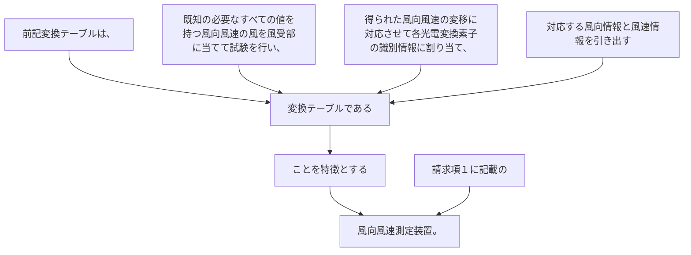

```mermaid
flowchart TD
A[前記変換テーブルは、]
B[既知の必要なすべての値を持つ風向風速の風を風受部に当てて試験を行い、]
C[得られた風向風速の変移に対応させて各光電変換素子の識別情報に割り当て、]
D[対応する風向情報と風速情報を引き出す]
E[変換テーブルである]
F[ことを特徴とする]
G[請求項１に記載の]
H[風向風速測定装置。]
A --> E
B --> E
C --> E
D --> E
E --> F
F --> H
G --> H
```