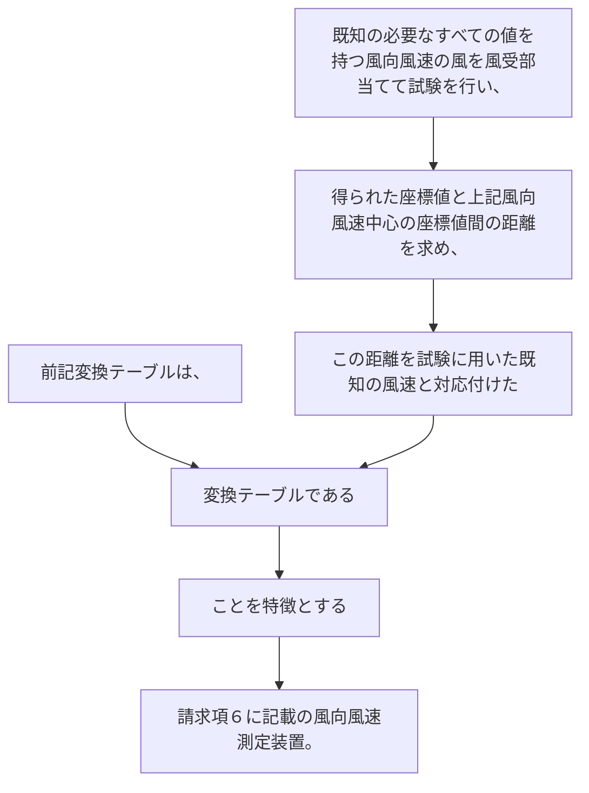

```mermaid
flowchart TD
A[前記変換テーブルは、]
B[既知の必要なすべての値を持つ風向風速の風を風受部当てて試験を行い、]
C[得られた座標値と上記風向風速中心の座標値間の距離を求め、]
D[この距離を試験に用いた既知の風速と対応付けた]
E[変換テーブルである]
F[ことを特徴とする]
G[請求項６に記載の風向風速測定装置。]

A --> E
B --> C
C --> D
D --> E
E --> F
F --> G
```