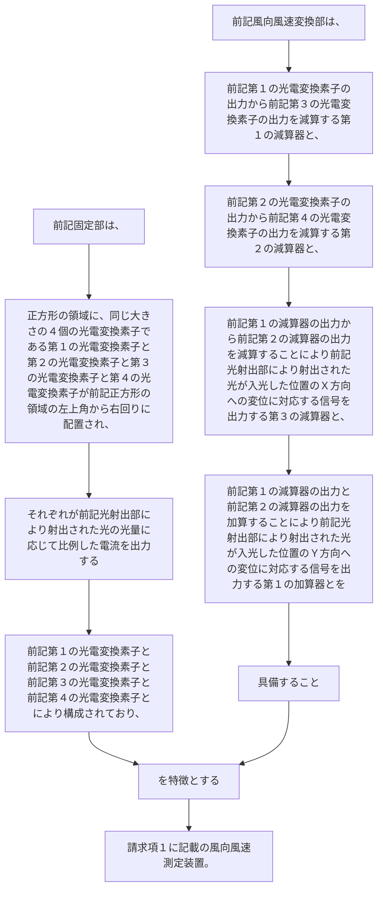

前記固定部は、
正方形の領域に、同じ大きさの４個の光電変換素子である第１の光電変換素子と第２の光電変換素子と第３の光電変換素子と第４の光電変換素子が前記正方形の領域の左上角から右回りに配置され、それぞれが前記光射出部により射出された光の光量に応じて比例した電流を出力する前記第１の光電変換素子と前記第２の光電変換素子と前記第３の光電変換素子と前記第４の光電変換素子とにより構成されており、
前記風向風速変換部は、
前記第１の光電変換素子の出力から前記第３の光電変換素子の出力を減算する第１の減算器と、前記第２の光電変換素子の出力から前記第４の光電変換素子の出力を減算する第２の減算器と、前記第１の減算器の出力から前記第２の減算器の出力を減算することにより前記光射出部により射出された光が入光した位置のＸ方向への変位に対応する信号を出力する第３の減算器と、前記第１の減算器の出力と前記第２の減算器の出力を加算することにより前記光射出部により射出された光が入光した位置のＹ方向への変位に対応する信号を出力する第１の加算器とを
具備することを特徴とする請求項１に記載の風向風速測定装置。
