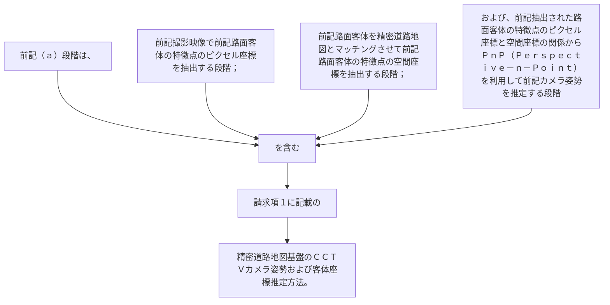

```mermaid
flowchart TD
A[前記（ａ）段階は、]
B[前記撮影映像で前記路面客体の特徴点のピクセル座標を抽出する段階；]
C[前記路面客体を精密道路地図とマッチングさせて前記路面客体の特徴点の空間座標を抽出する段階；]
D[および、前記抽出された路面客体の特徴点のピクセル座標と空間座標の関係からＰｎＰ（Ｐｅｒｓｐｅｃｔｉｖｅ－ｎ－Ｐｏｉｎｔ）を利用して前記カメラ姿勢を推定する段階]
E[を含む]
F[請求項１に記載の]
G[精密道路地図基盤のＣＣＴＶカメラ姿勢および客体座標推定方法。]

A --> E
B --> E
C --> E
D --> E
E --> F
F --> G
```