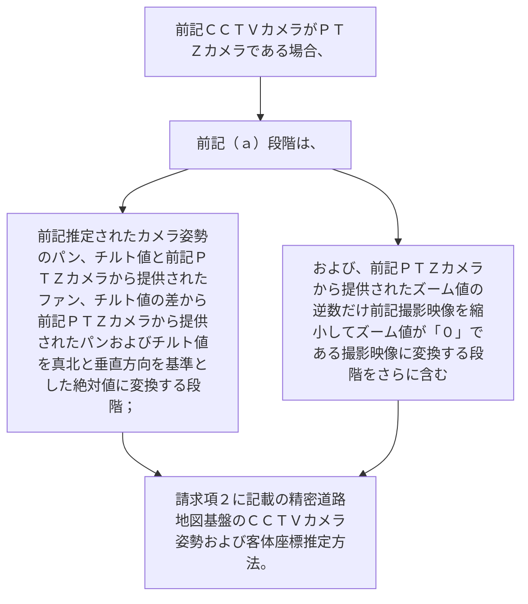

```mermaid
flowchart TD
N1[前記ＣＣＴＶカメラがＰＴＺカメラである場合、]
N2[前記（ａ）段階は、]
N3[前記推定されたカメラ姿勢のパン、チルト値と前記ＰＴＺカメラから提供されたファン、チルト値の差から前記ＰＴＺカメラから提供されたパンおよびチルト値を真北と垂直方向を基準とした絶対値に変換する段階；]
N4[および、前記ＰＴＺカメラから提供されたズーム値の逆数だけ前記撮影映像を縮小してズーム値が「０」である撮影映像に変換する段階をさらに含む]
N5[請求項２に記載の精密道路地図基盤のＣＣＴＶカメラ姿勢および客体座標推定方法。]

N1 --> N2
N2 --> N3
N2 --> N4
N3 --> N5
N4 --> N5
```