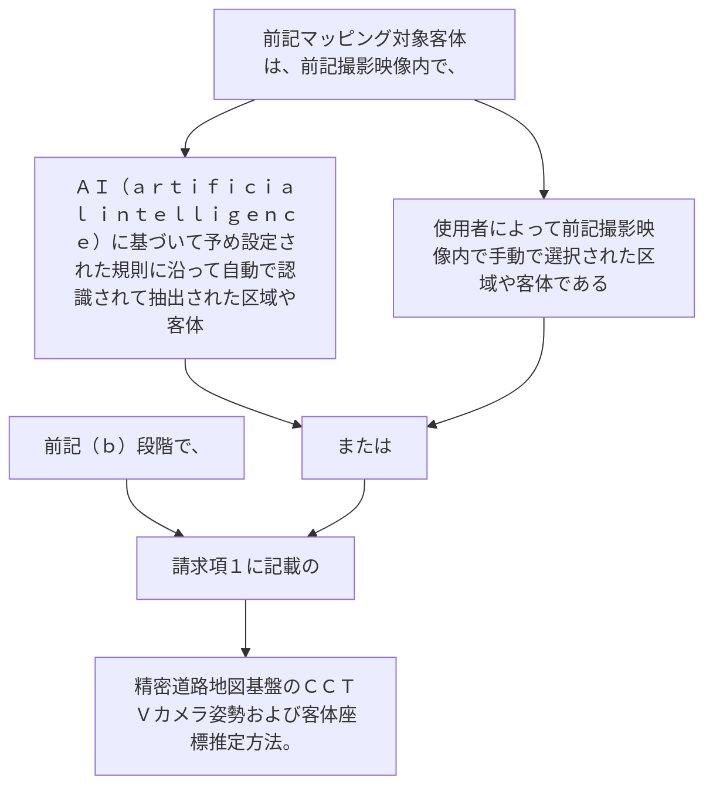

```mermaid
flowchart TD
A[前記（ｂ）段階で、]
B[前記マッピング対象客体は、前記撮影映像内で、]
C[ＡＩ（ａｒｔｉｆｉｃｉａｌ ｉｎｔｅｌｌｉｇｅｎｃｅ）に基づいて予め設定された規則に沿って自動で認識されて抽出された区域や客体]
D[または]
E[使用者によって前記撮影映像内で手動で選択された区域や客体である]
F[請求項１に記載の]
G[精密道路地図基盤のＣＣＴＶカメラ姿勢および客体座標推定方法。]

A --> F
F --> G
B --> C
B --> E
C --> D
E --> D
D --> F
```