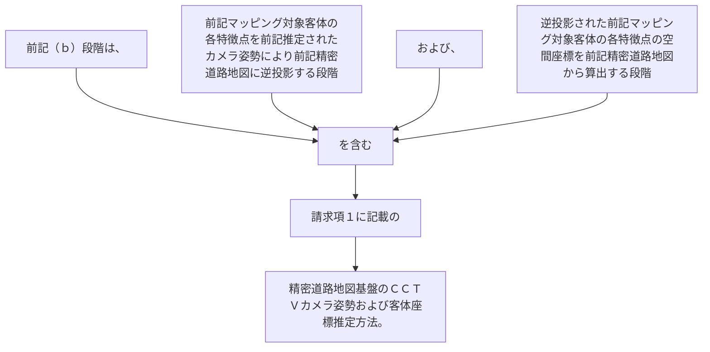

前記（ｂ）段階は、
前記マッピング対象客体の各特徴点を前記推定されたカメラ姿勢により前記精密道路地図に逆投影する段階；および、
逆投影された前記マッピング対象客体の各特徴点の空間座標を前記精密道路地図から算出する段階を含む
請求項１に記載の精密道路地図基盤のＣＣＴＶカメラ姿勢および客体座標推定方法。

```mermaid
flowchart TD
A[前記（ｂ）段階は、]
B[前記マッピング対象客体の各特徴点を前記推定されたカメラ姿勢により前記精密道路地図に逆投影する段階]
C[および、]
D[逆投影された前記マッピング対象客体の各特徴点の空間座標を前記精密道路地図から算出する段階]
E[を含む]
F[請求項１に記載の]
G[精密道路地図基盤のＣＣＴＶカメラ姿勢および客体座標推定方法。]

A --> E
B --> E
C --> E
D --> E
E --> F
F --> G
```