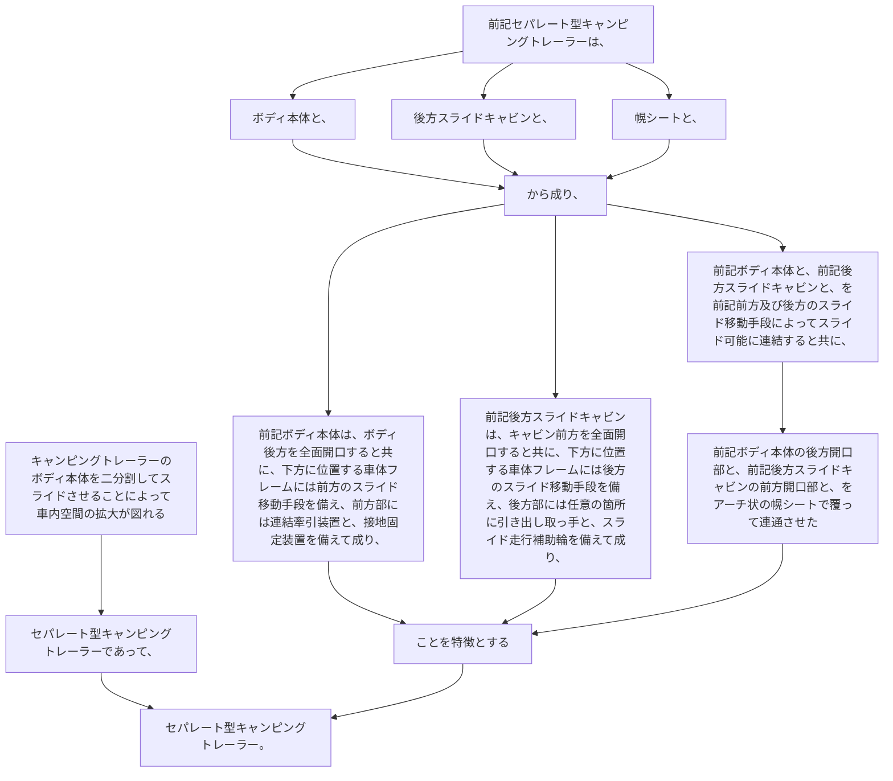

キャンピングトレーラーのボディ本体を二分割してスライドさせることによって車内空間の拡大が図れるセパレート型キャンピングトレーラーであって、
前記セパレート型キャンピングトレーラーは、ボディ本体と、後方スライドキャビンと、幌シートと、から成り、
前記ボディ本体は、ボディ後方を全面開口すると共に、下方に位置する車体フレームには前方のスライド移動手段を備え、前方部には連結牽引装置と、接地固定装置を備えて成り、
前記後方スライドキャビンは、キャビン前方を全面開口すると共に、下方に位置する車体フレームには後方のスライド移動手段を備え、後方部には任意の箇所に引き出し取っ手と、スライド走行補助輪を備えて成り、
前記ボディ本体と、前記後方スライドキャビンと、を前記前方及び後方のスライド移動手段によってスライド可能に連結すると共に、前記ボディ本体の後方開口部と、前記後方スライドキャビンの前方開口部と、をアーチ状の幌シートで覆って連通させたことを特徴とするセパレート型キャンピングトレーラー。
