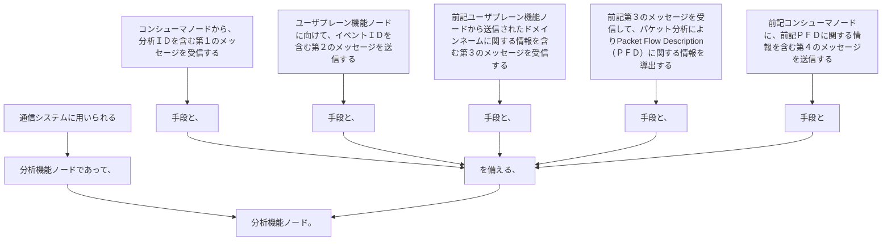

```mermaid
flowchart TD
A[通信システムに用いられる]
B[分析機能ノードであって、]
C[コンシューマノードから、分析ＩＤを含む第１のメッセージを受信する]
D[手段と、]
E[ユーザプレーン機能ノードに向けて、イベントＩＤを含む第２のメッセージを送信する]
F[手段と、]
G[前記ユーザプレーン機能ノードから送信されたドメインネームに関する情報を含む第３のメッセージを受信する]
H[手段と、]
I[前記第３のメッセージを受信して、パケット分析によりPacket Flow Description（ＰＦＤ）に関する情報を導出する]
J[手段と、]
K[前記コンシューマノードに、前記ＰＦＤに関する情報を含む第４のメッセージを送信する]
L[手段と]
M[を備える、]
N[分析機能ノード。]

A --> B
B --> N
C --> D
E --> F
G --> H
I --> J
K --> L
D --> M
F --> M
H --> M
J --> M
L --> M
M --> N
```