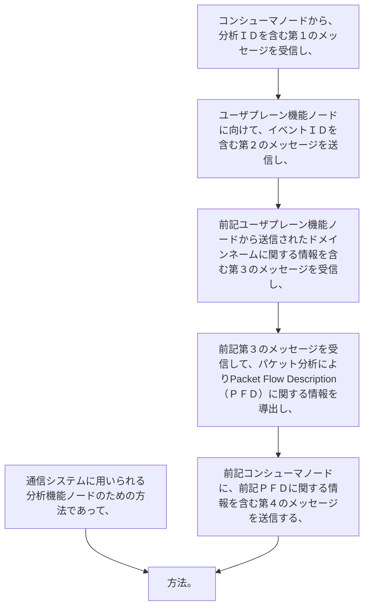

```mermaid
flowchart TD
A[通信システムに用いられる分析機能ノードのための方法であって、]
B[コンシューマノードから、分析ＩＤを含む第１のメッセージを受信し、]
C[ユーザプレーン機能ノードに向けて、イベントＩＤを含む第２のメッセージを送信し、]
D[前記ユーザプレーン機能ノードから送信されたドメインネームに関する情報を含む第３のメッセージを受信し、]
E[前記第３のメッセージを受信して、パケット分析によりPacket Flow Description（ＰＦＤ）に関する情報を導出し、]
F[前記コンシューマノードに、前記ＰＦＤに関する情報を含む第４のメッセージを送信する、]
G[方法。]

A --> G
B --> C
C --> D
D --> E
E --> F
F --> G
```