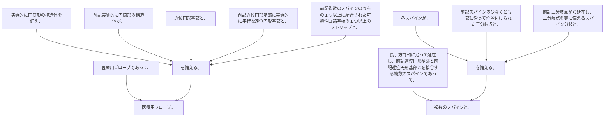

```mermaid
flowchart TD
A[医療用プローブであって、]
B[実質的に円筒形の構造体を備え、]
C[前記実質的に円筒形の構造体が、]
D[近位円形基部と、]
E[前記近位円形基部に実質的に平行な遠位円形基部と、]
F[長手方向軸に沿って延在し、前記遠位円形基部と前記近位円形基部とを接合する複数のスパインであって、]
G[各スパインが、]
H[前記スパインの少なくとも一部に沿って位置付けられた三分岐点と、]
I[前記三分岐点から延在し、二分岐点を更に備えるスパイン分岐と、]
J[を備える、]
K[複数のスパインと、]
L[前記複数のスパインのうちの１つ以上に結合された可撓性回路基板の１つ以上のストリップと、]
M[を備える、]
N[医療用プローブ。]

A --> N
B --> M
C --> M
D --> M
E --> M
L --> M
M --> N

F --> K
G --> J
H --> J
I --> J
J --> K
```