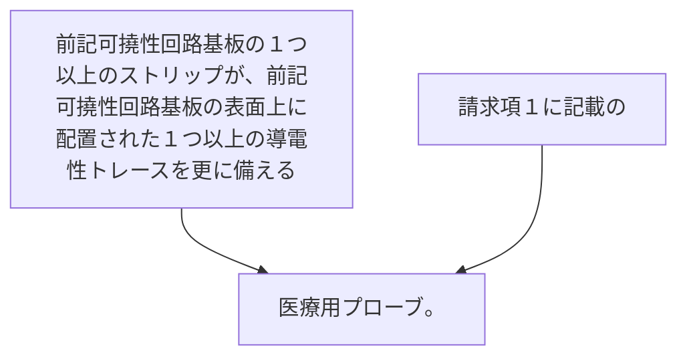

前記可撓性回路基板の１つ以上のストリップが、前記可撓性回路基板の表面上に配置された１つ以上の導電性トレースを更に備える、請求項１に記載の医療用プローブ。

```mermaid
flowchart TD
A[前記可撓性回路基板の１つ以上のストリップが、前記可撓性回路基板の表面上に配置された１つ以上の導電性トレースを更に備える]
B[請求項１に記載の]
C[医療用プローブ。]
A --> C
B --> C
```