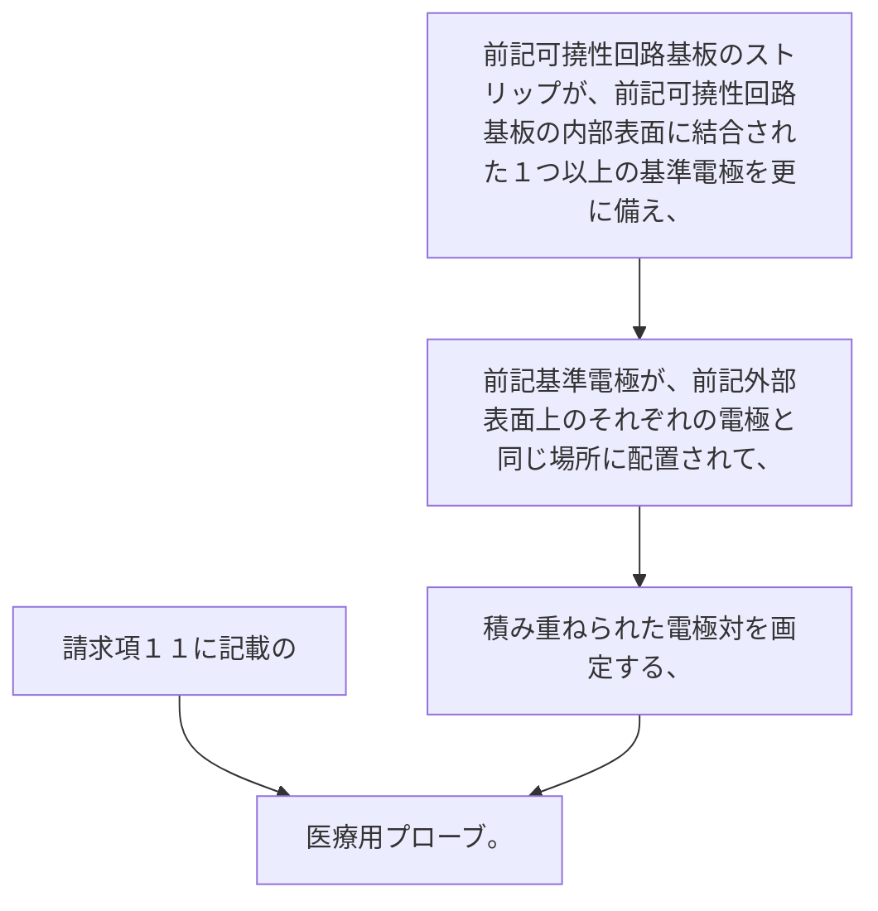

前記可撓性回路基板のストリップが、前記可撓性回路基板の内部表面に結合された１つ以上の基準電極を更に備え、前記基準電極が、前記外部表面上のそれぞれの電極と同じ場所に配置されて、積み重ねられた電極対を画定する、請求項１１に記載の医療用プローブ。

```mermaid
flowchart TD
A[請求項１１に記載の]
B[医療用プローブ。]
C[前記可撓性回路基板のストリップが、前記可撓性回路基板の内部表面に結合された１つ以上の基準電極を更に備え、]
D[前記基準電極が、前記外部表面上のそれぞれの電極と同じ場所に配置されて、]
E[積み重ねられた電極対を画定する、]
A --> B
C --> D
D --> E
E --> B
```