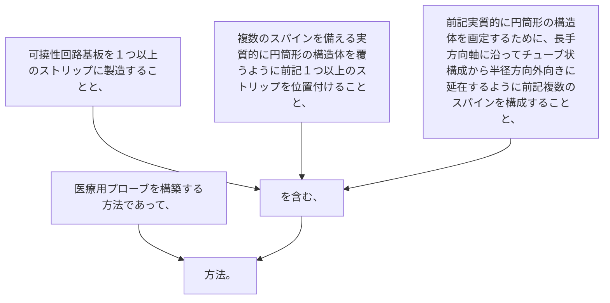

```mermaid
flowchart TD
A[医療用プローブを構築する方法であって、]
B[可撓性回路基板を１つ以上のストリップに製造することと、]
C[複数のスパインを備える実質的に円筒形の構造体を覆うように前記１つ以上のストリップを位置付けることと、]
D[前記実質的に円筒形の構造体を画定するために、長手方向軸に沿ってチューブ状構成から半径方向外向きに延在するように前記複数のスパインを構成することと、]
E[を含む、]
F[方法。]
A --> F
B --> E
C --> E
D --> E
E --> F
```