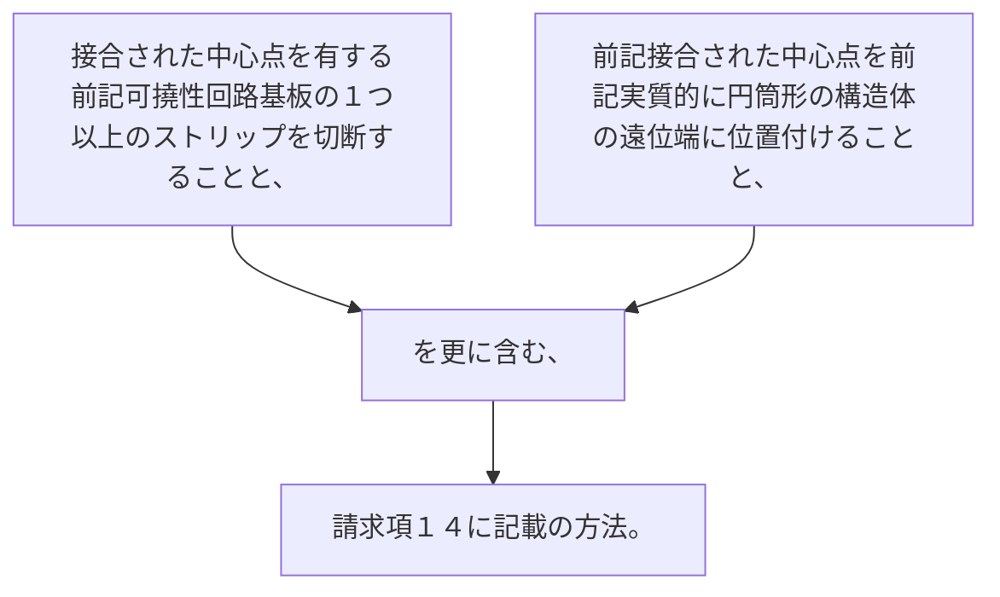

接合された中心点を有する前記可撓性回路基板の１つ以上のストリップを切断することと、
前記接合された中心点を前記実質的に円筒形の構造体の遠位端に位置付けることと、を更に含む、請求項１４に記載の方法。

```mermaid
flowchart TD
A[接合された中心点を有する前記可撓性回路基板の１つ以上のストリップを切断することと、]
B[前記接合された中心点を前記実質的に円筒形の構造体の遠位端に位置付けることと、]
C[を更に含む、]
D[請求項１４に記載の方法。]
A --> C
B --> C
C --> D
```