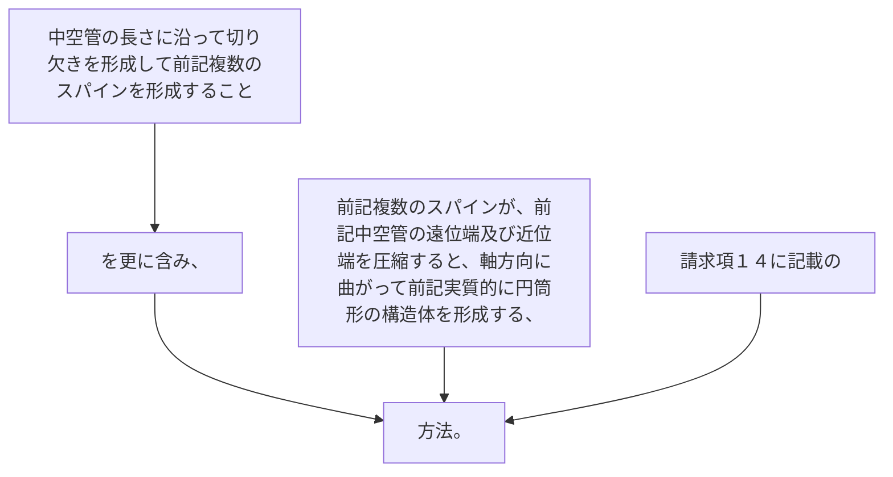

中空管の長さに沿って切り欠きを形成して前記複数のスパインを形成することを更に含み、前記複数のスパインが、前記中空管の遠位端及び近位端を圧縮すると、軸方向に曲がって前記実質的に円筒形の構造体を形成する、請求項１４に記載の方法。

```mermaid
flowchart TD
A[中空管の長さに沿って切り欠きを形成して前記複数のスパインを形成すること]
B[を更に含み、]
C[前記複数のスパインが、前記中空管の遠位端及び近位端を圧縮すると、軸方向に曲がって前記実質的に円筒形の構造体を形成する、]
D[請求項１４に記載の]
E[方法。]
A --> B
B --> E
C --> E
D --> E
```