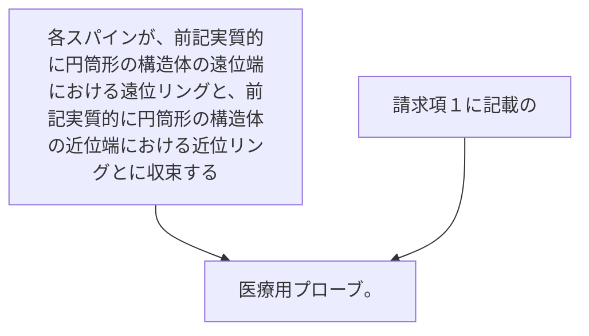

各スパインが、前記実質的に円筒形の構造体の遠位端における遠位リングと、前記実質的に円筒形の構造体の近位端における近位リングとに収束する、請求項１に記載の医療用プローブ。

```mermaid
flowchart TD
A[各スパインが、前記実質的に円筒形の構造体の遠位端における遠位リングと、前記実質的に円筒形の構造体の近位端における近位リングとに収束する]
B[請求項１に記載の]
C[医療用プローブ。]
A --> C
B --> C
```