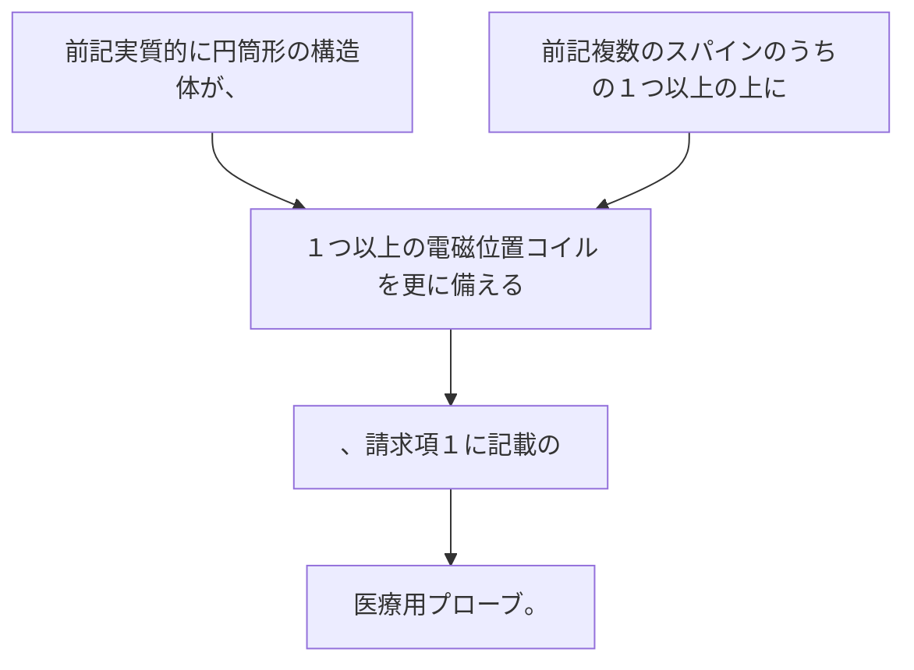

前記実質的に円筒形の構造体が、前記複数のスパインのうちの１つ以上の上に１つ以上の電磁位置コイルを更に備える、請求項１に記載の医療用プローブ。

```mermaid
flowchart TD
A[前記実質的に円筒形の構造体が、]
B[前記複数のスパインのうちの１つ以上の上に]
C[１つ以上の電磁位置コイルを更に備える]
D[、請求項１に記載の]
E[医療用プローブ。]
A --> C
B --> C
C --> D
D --> E
```